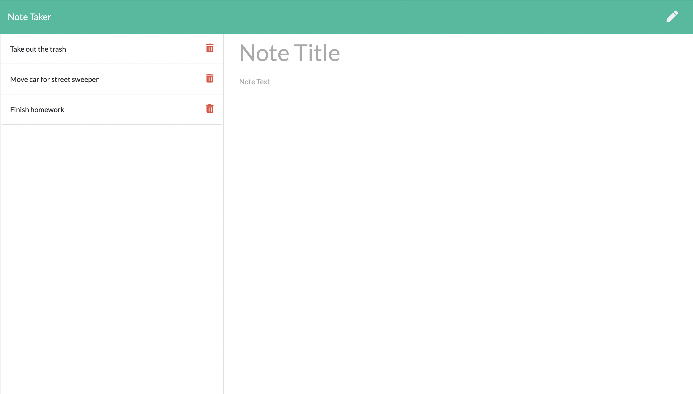

### Note Taker

### Motivation

* The motivation for building this app is always forgetting everything that you need to do. With this application, you can create notes to remind you of things that need to be done throughout the day that you may have otherwise forgotten. We all have those moments where we are working on a project or something important and we come up with a good idea to be used for later and then when the time comes, you completely forget what that idea was. This application makes it quick and easy to store your thoughts and be able to quickly erase them when you are finished with the thought or note that you needed to get reminded.

### Features

* This application currently has the ability to create notes with a title and text. It alllows you to save, delete, and read notes. When a note has been created, you can easily click on the note and whatever was written on the note will appear on the screen where it was written. If you are in the viewing screen and want to write another note, on the top left a pencil button can be pressed to go back to the input screen where you can write a new note.

### Build Status

* This build is currently near it's final form. There are only a few more areas of improvement where things can be added to make the appkication more useful and dynamic.

### Future Development

* For future development, we would like to add the ability to have a small window somewhere on the screen that shows a snippet of some of your notes to give you a small reminder of things that you might need to get reminded of. Have an option to remind you of a certain note with a timer on it so that the user gets a notification at a certain time with a certain note of their choosing.

### Screenshots

*